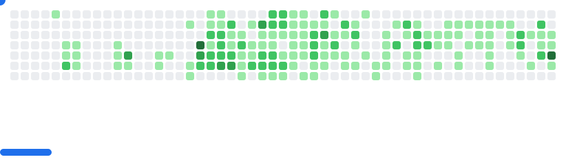

# Github Breakout

Generate a Breakout game SVG from a GitHub user's contributions graph

This project will grab your contribution graph through the GitHub API and generate images for light and dark mode:

<picture>
  <source
    media="(prefers-color-scheme: dark)"
    srcset="example/dark.svg"
  />
  <source
    media="(prefers-color-scheme: light)"
    srcset="example/light.svg"
  />
  
</picture>

## Usage

### GitHub Action

You can use the provided GitHub Action to build the SVGs so you can display them like on my profile ([github.com/cyprieng](https://github.com/cyprieng)):

Generate the SVGs every day and commit them to your repository:

```yaml
name: generate breakout svg

on:
  schedule:
    - cron: "0 */24 * * *"
  workflow_dispatch:

jobs:
  generate-svg:
    permissions:
      contents: write
    runs-on: ubuntu-latest
    timeout-minutes: 5

    steps:
      - name: Checkout repository
        uses: actions/checkout@v4

      - name: generate SVG
        uses: cyprieng/github-breakout@v1.0.0
        with:
          github_username: ${{ github.repository_owner }}

      - name: Move generated SVGs
        run: |
          mkdir -p images
          mv output/light.svg images/breakout-light.svg
          mv output/dark.svg images/breakout-dark.svg

      - name: Configure git
        run: |
          git config user.name "github-actions[bot]"
          git config user.email "github-actions[bot]@users.noreply.github.com"

      - name: Commit and push SVGs
        run: |
          git add images/breakout-light.svg images/breakout-dark.svg
          git commit -m "chore: update breakout SVGs" || echo "No changes to commit"
          git push
```

Add them to your README.md:

```html
<picture>
  <source
    media="(prefers-color-scheme: dark)"
    srcset="images/breakout-dark.svg"
  />
  <source
    media="(prefers-color-scheme: light)"
    srcset="images/breakout-light.svg"
  />
  
</picture>
```

### CLI

You need to get a GitHub Token, then you can run the following command:

`node dist/cli.js {username} {github token} {dark mode: true/false}`

### Library

The package is currently not available on npm, so you can install it with:

`npm i --save git+ssh://git@github.com:cyprieng/github-breakout.git`

And then you can use it like this:

```javascript
import { generateSVG } from "github-breakout";

await generateSVG(username, token, false);
```

### Try it

You can try it here: [www.cyprien.io/projects/github-breakout](https://www.cyprien.io/projects/github-breakout/#try-it)
